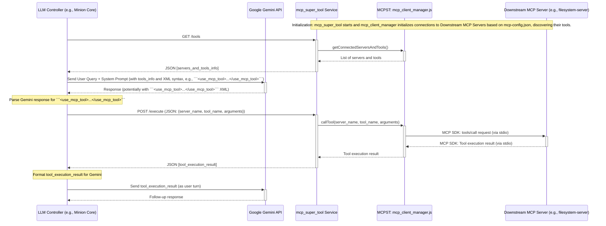

# Analysis of mcp_super_tool Component

**Date:** 2025-05-10
**Analyst:** Roo (AI Technical Leader)
**Version:** 1.0

## 1. Introduction

This document provides a detailed analysis of the `mcp_super_tool` Node.js component, a key part of the AI Minion Army project. The analysis focuses on its architecture, core logic, interaction with the Gemini API (historically) and downstream Model Context Protocol (MCP) servers, configuration management, and overall workflow. The primary files analyzed include:

*   [`mcp_super_tool/README.md`](mcp_super_tool/README.md)
*   [`mcp_super_tool/package.json`](mcp_super_tool/package.json)
*   [`mcp_super_tool/src/main.js`](mcp_super_tool/src/main.js) (Entry Point & HTTP Service)
*   [`mcp_super_tool/src/gemini_interactor.js`](mcp_super_tool/src/gemini_interactor.js) (Historical Gemini API Interaction)
*   [`mcp_super_tool/src/mcp_client_manager.js`](mcp_super_tool/src/mcp_client_manager.js) (Downstream MCP Server Management)
*   [`mcp_super_tool/src/tool_parser.js`](mcp_super_tool/src/tool_parser.js) (Historical LLM Tool Call Parsing)
*   [`mcp_super_tool/src/prompt_builder.js`](mcp_super_tool/src/prompt_builder.js) (Historical System Prompt Construction)
*   [`mcp_super_tool/mcp-config.json`](mcp_super_tool/mcp-config.json) (MCP Server Definitions)
*   [`system_configs/config.toml`](system_configs/config.toml) (System-wide Configurations)

The `mcp_super_tool` has evolved from a component directly interacting with Gemini to a dedicated service that manages and exposes tools from various MCP servers over HTTP. This service is intended to be consumed by an upstream LLM controller, such as `minion_core`.

## 2. Overview of Architecture and Key Modules

`mcp_super_tool` is a Node.js application built using Express.js to provide an HTTP service. Its primary responsibilities in the current architecture are:

1.  **Managing Downstream MCP Servers:** It reads configurations from [`mcp-config.json`](mcp_super_tool/mcp-config.json), starts specified MCP servers as child processes, and communicates with them using the `@modelcontextprotocol/sdk` via `StdioClientTransport`.
2.  **Tool Discovery:** It queries connected MCP servers for their available tools (names, descriptions, input schemas).
3.  **Exposing Tool Capabilities:** It provides HTTP endpoints:
    *   `GET /tools`: Returns a list of all available tools from all connected MCP servers.
    *   `POST /execute`: Accepts requests to execute a specific tool on a specific MCP server with given arguments.

**Key Modules:**

*   **[`src/main.js`](mcp_super_tool/src/main.js):**
    *   The main entry point.
    *   Sets up the Express.js HTTP server.
    *   Defines the `/tools` and `/execute` API endpoints.
    *   Initializes and relies on `mcp_client_manager.js` for all MCP-related operations.
    *   Handles graceful shutdown and basic error logging.
    *   Comments indicate that direct Gemini interaction, prompt building, and tool parsing have been moved upstream.
*   **[`src/mcp_client_manager.js`](mcp_super_tool/src/mcp_client_manager.js):**
    *   The core module for managing connections to downstream MCP servers.
    *   Reads [`mcp-config.json`](mcp_super_tool/mcp-config.json) to discover server definitions.
    *   Uses `@modelcontextprotocol/sdk`'s `Client` and `StdioClientTransport` to start and communicate with MCP servers as child processes (via stdin/stdout).
    *   Fetches tool lists (`tools/list`) from each connected server.
    *   Executes tool calls (`tools/call`) on specified servers with provided arguments.
    *   Manages the lifecycle (connection, shutdown) of these MCP server processes.
*   **[`mcp-config.json`](mcp_super_tool/mcp-config.json):**
    *   JSON configuration file defining the MCP servers to be managed.
    *   Specifies the `command`, `args`, `env`, `disabled` status, and `timeout` for each server.
*   **[`package.json`](mcp_super_tool/package.json):**
    *   Defines project metadata, scripts (`start`), and dependencies.
    *   Key dependencies include: `@google/generative-ai` (for historical Gemini interaction), `@modelcontextprotocol/sdk`, `dotenv`, `express`, `fast-xml-parser`, `fs-extra`.

**Historically Important (Functionality now largely upstream):**

*   **[`src/gemini_interactor.js`](mcp_super_tool/src/gemini_interactor.js):** Originally handled all direct communication with the Google Gemini API, including API key management, chat history, sending messages, and processing responses. It was designed to feed tool results back to Gemini.
*   **[`src/tool_parser.js`](mcp_super_tool/src/tool_parser.js):** Originally responsible for parsing Gemini's text responses to detect and extract XML blocks like ```<use_mcp_tool>...</use_mcp_tool>```, converting them into structured tool call requests. It used `fast-xml-parser`.
*   **[`src/prompt_builder.js`](mcp_super_tool/src/prompt_builder.js):** Originally constructed the detailed system prompt for Gemini, informing it about available tools, their schemas, and the precise XML syntax for invoking them.

## 3. Configuration Management

*   **Primary Configuration:** [`mcp_super_tool/mcp-config.json`](mcp_super_tool/mcp-config.json) is the main configuration file for `mcp_super_tool` itself. It defines which downstream MCP servers to launch and manage.
    *   Each server entry includes `command`, `args`, `env`, `disabled`, and `timeout`.
*   **API Key (Historical):** The [`README.md`](mcp_super_tool/README.md) and [`gemini_interactor.js`](mcp_super_tool/src/gemini_interactor.js) specified using a `.env` file in the `mcp_super_tool` directory for the `GEMINI_API_KEY`.
*   **Service Port:** The HTTP service port is configurable via the `MCP_SERVICE_PORT` environment variable, defaulting to `3000` (see [`src/main.js`](mcp_super_tool/src/main.js)).
*   **System-Wide Configuration ([`system_configs/config.toml`](system_configs/config.toml)):**
    *   The `[mcp_integration]` section in [`config.toml`](system_configs/config.toml) is relevant for how `mcp_super_tool` is integrated into the larger system:
        *   `mcp_node_service_base_url`: Specifies the URL for `mcp_super_tool` (e.g., `http://localhost:3000`), used by upstream components like `minion_core`.
        *   `mcp_node_service_startup_command`: Defines how to start `mcp_super_tool`.
        *   `manage_mcp_node_service_lifecycle`: A boolean indicating if `minion_core` should manage the lifecycle of `mcp_super_tool`. Currently `false`.
    *   The `[llm]` section specifies `gemini_api_key_env_var = "GEMINI_API_KEY_LEGION"` (see [`config.toml`](system_configs/config.toml)) for the upstream LLM controller.

## 4. Interaction with Gemini API (Historical & Current Context)

Historically, `mcp_super_tool` was designed for direct Gemini API interaction via [`src/gemini_interactor.js`](mcp_super_tool/src/gemini_interactor.js). This module would:
1.  Initialize with a system prompt (from [`src/prompt_builder.js`](mcp_super_tool/src/prompt_builder.js)) detailing available tools and invocation syntax.
2.  Manage chat history.
3.  Send user messages to Gemini.
4.  Receive Gemini's responses.
5.  If a tool call was made by Gemini, [`src/tool_parser.js`](mcp_super_tool/src/tool_parser.js) would parse it.
6.  The tool would be executed via [`src/mcp_client_manager.js`](mcp_super_tool/src/mcp_client_manager.js).
7.  The result would be formatted and sent back to Gemini by [`gemini_interactor.js`](mcp_super_tool/src/gemini_interactor.js) to continue the conversation.

**Current Context:** This direct Gemini interaction logic is now presumed to reside **upstream** (e.g., in `minion_core`'s `llm_interface.py` or `McpNodeBridge`). `mcp_super_tool` now acts as a service that:
1.  Provides tool definitions to the upstream LLM controller via its `/tools` endpoint.
2.  Executes parsed tool calls received from the upstream LLM controller via its `/execute` endpoint.

The upstream LLM controller is now responsible for constructing the system prompt, sending requests to Gemini, parsing Gemini's responses for tool calls, and then interacting with `mcp_super_tool`'s HTTP API.

## 5. Communication with Downstream MCP Servers

Communication with downstream MCP servers is managed by [`src/mcp_client_manager.js`](mcp_super_tool/src/mcp_client_manager.js):

1.  **Server Launch:** For each enabled server in [`mcp-config.json`](mcp_super_tool/mcp-config.json), `mcp_client_manager` uses `StdioClientTransport` from the `@modelcontextprotocol/sdk` to launch the server as a child process using the specified `command`, `args`, and `env`.
2.  **Communication Protocol:** Communication occurs over the child process's **stdin and stdout**, adhering to the Model Context Protocol.
3.  **Tool Discovery:** Upon successful connection, `mcp_client_manager` sends a `tools/list` request to the MCP server to get a list of its available tools, descriptions, and input schemas.
4.  **Tool Execution:** When the `/execute` endpoint of `mcp_super_tool` is called, `mcp_client_manager` sends a `tools/call` request (with `tool_name` and `arguments`) to the appropriate downstream MCP server. It handles timeouts for these calls.
5.  **Error Handling:** Basic error handling for transport errors, connection closures, and tool call failures is implemented. `stderr` from child MCP processes is logged.
6.  **Shutdown:** `mcp_client_manager` provides a `shutdown` method to gracefully close connections and terminate child MCP server processes.

## 6. End-to-End Tool Execution Workflow (Current Architecture)



**Workflow Steps:**

1.  **Upstream LLM Interaction (e.g., `minion_core`):**
    *   The LLM Controller gets tool info from `mcp_super_tool`'s `/tools` endpoint.
    *   It constructs a system prompt and sends it with the user query to Gemini.
2.  **Gemini Determines Tool Use:** Gemini responds, potentially including an XML block like ```<use_mcp_tool>...</use_mcp_tool>```.
3.  **Upstream Parsing & Dispatch:** The LLM Controller parses the XML and sends a `POST` request to `mcp_super_tool`'s `/execute` endpoint.
4.  **`mcp_super_tool` Executes Tool:**
    *   [`main.js`](mcp_super_tool/src/main.js) calls `mcpClientManager.callTool()`.
    *   `mcpClientManager` sends a `tools/call` request to the target downstream MCP server via stdio.
5.  **Result Propagation:**
    *   The downstream MCP server returns the result to `mcpClientManager`.
    *   `mcp_super_tool` returns this result to the LLM Controller.
    *   The LLM Controller sends the result back to Gemini to continue the conversation.

## 7. Potential Issues, Inconsistencies, and Areas for Improvement

**Error Handling & Propagation:**
*   Error reporting from `/execute` could be more granular for better upstream handling.
*   `mcp_super_tool` service is a single point of failure if not managed externally (as per current `manage_mcp_node_service_lifecycle = false` in [`system_configs/config.toml`](system_configs/config.toml)).
*   Limited detection of non-crashing faulty states in downstream MCPs beyond timeouts.

**Security:**
*   HTTP endpoints (`/tools`, `/execute`) are unauthenticated.
*   Implicit trust in [`mcp-config.json`](mcp_super_tool/mcp-config.json) entries for command execution.
*   `mcp_super_tool` does not re-validate tool arguments against schemas; relies on downstream MCPs.
*   Historical Gemini safety settings in [`gemini_interactor.js`](mcp_super_tool/src/gemini_interactor.js) were `BLOCK_NONE`; upstream must now manage this.

**Scalability & Performance:**
*   Single Node.js process for `mcp_super_tool` could be a bottleneck.
*   Potential overhead from managing many stdio-based child processes at high scale.
*   Tool discovery is static (on init); no dynamic updates if downstream MCPs change their tool offerings post-launch.

**Configuration & System Inconsistencies/Clarifications:**
*   Historical difference in Gemini API key environment variable names (`GEMINI_API_KEY` vs. `GEMINI_API_KEY_LEGION`). Less critical now as interaction is upstream.
*   Current `manage_mcp_node_service_lifecycle = false` in [`system_configs/config.toml`](system_configs/config.toml) means `mcp_super_tool` requires independent startup.
*   Current `enable_mcp_integration = false` in [`system_configs/config.toml`](system_configs/config.toml) would prevent minions from using this MCP setup unless changed.

**Completeness of Tool Handling Logic & Missing Features:**
*   No `access_mcp_resource` implementation (mentioned as placeholder).
*   No dynamic tool re-discovery or updates.
*   Limited `stderr` interpretation from downstream MCPs.
*   No retry logic for failed MCP connections or transient tool call errors.
*   Basic MCP server state management (no advanced health monitoring or auto-reconnect).
*   Limited configurability of `mcp_super_tool` service itself (e.g., advanced logging).

**Architectural Shift Implications & Dependencies:**
*   The upstream LLM controller (e.g., `minion_core`) *must* correctly implement logic for tool discovery (via `/tools`), system prompt construction, Gemini interaction, tool call parsing (similar to [`tool_parser.js`](mcp_super_tool/src/tool_parser.js)), and dispatching to `/execute`. The original modules in `mcp_super_tool` serve as a reference.

## 8. Conclusion

The `mcp_super_tool` component has transitioned into a focused service for managing and exposing downstream MCP tools via an HTTP API. It effectively uses the `@modelcontextprotocol/sdk` for this purpose. The primary interaction with LLMs (like Gemini) has been shifted to an upstream component, which now relies on `mcp_super_tool`'s `/tools` and `/execute` endpoints.

While functional in its current role, several areas related to error handling, security, scalability, and feature completeness (like dynamic tool updates or `access_mcp_resource`) could be enhanced for greater robustness and capability in a production environment. The successful operation of the overall tool-use chain heavily depends on the correct implementation of the LLM interaction logic in the upstream controller.