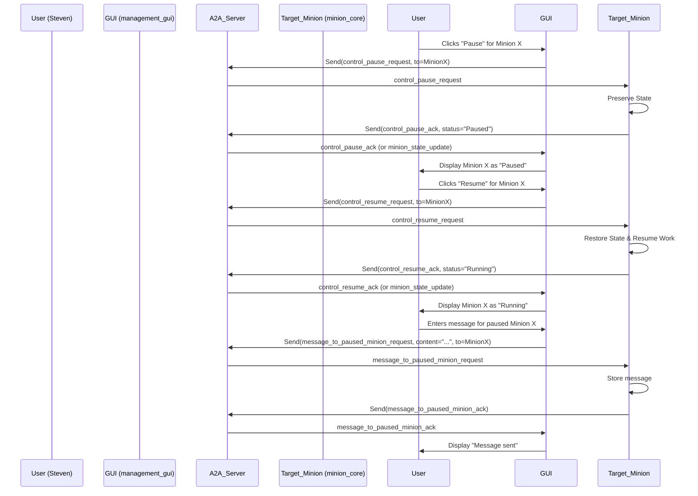

# Minion Process Control Features: Design Document

## 1. Introduction

This document outlines the design for implementing process control features for AI Minions within Steven's Army. These features include the ability for a user (Steven, via the Management GUI) to pause, resume, and send messages to paused Minions. The goal is to provide better control and intervention capabilities over Minion operations.

## 2. Requirements for Process Control

### 2.1. Pausing a Minion's Workflow

*   **User Initiation:**
    *   Steven, through the [`management_gui/gui_app.py`](management_gui/gui_app.py:1), should be able to select a specific Minion and issue a "pause" command.
    *   The GUI will send a new A2A message type (e.g., `control_pause_request`) to the target Minion via the A2A server.
*   **Definition of "Paused":**
    *   **Stops Current Action:** The Minion will attempt to gracefully halt its current action at the earliest safe point (e.g., after a sub-task, before starting a new LLM call or tool use). It will not abruptly terminate operations that could lead to inconsistent states or resource leaks.
    *   **No New Tasks:** A paused Minion will not pick up new tasks from any queue or accept new directives (except for control messages like "resume" or "message_to_paused").
    *   **Maintains Current State:** The Minion must preserve its current operational state. This includes its current task, progress within that task, internal variables, relevant conversation history, and any intermediate results.
    *   **LLM Processing Halted:** Active LLM generation or interaction via [`minion_core/llm_interface.py`](minion_core/llm_interface.py:1) should be suspended. If an LLM call is in flight, the Minion might wait for its completion before fully pausing, or it might need a mechanism to cancel/ignore the result if paused mid-request (this is complex). For V1, we'll assume it completes any immediate, short LLM interaction or tool use step before fully entering pause.
    *   **A2A Listener Active for Control:** The Minion's A2A client ([`minion_core/a2a_client.py`](minion_core/a2a_client.py:21)) must remain active to listen for `control_resume_request` or `message_to_paused_minion_request` messages.
*   **State Preservation:**
    *   The Minion's state will be serialized and stored. The exact mechanism is detailed in Section 4 (State Management).
    *   This might involve saving to a local file or an in-memory structure that can be persisted if the Minion process itself needs to be robust against restarts (though V1 might focus on in-memory pause state for a running Minion).
*   **Autonomous Pause (Future Consideration / V2):**
    *   While not the primary focus for V1, the architecture should consider that a Minion might autonomously decide to pause itself (e.g., critical error, waiting for essential external input not available via tools, resource limits). This would involve the Minion sending a state update to the A2A server/GUI.

### 2.2. Resuming a Minion's Workflow

*   **User Initiation:**
    *   Steven, via the GUI, can select a paused Minion and issue a "resume" command.
    *   The GUI will send a `control_resume_request` A2A message to the target Minion.
*   **State Restoration and Continuation:**
    *   Upon receiving a resume command, the Minion will deserialize its saved state.
    *   It will attempt to continue its work from the exact point it was paused. This means re-initializing necessary components with the saved state and continuing its logic flow.
    *   If it was in the middle of a multi-step process, it should resume that process.
*   **Invalid Resumption Conditions:**
    *   If the conditions required for resuming are no longer valid (e.g., a resource is unavailable, a dependent task failed while paused), the Minion should log this, report an error state back to the GUI (via an A2A `minion_state_update` message), and potentially remain paused or enter an error state.

### 2.3. Messaging Paused Minions

*   **User Initiation:**
    *   Steven, via the GUI, can select a paused Minion and send a message or new instructions.
    *   The GUI will send a `message_to_paused_minion_request` A2A message, containing the user's message content.
*   **Handling Incoming Messages by Paused Minion:**
    *   **Queueing:** The Minion will receive the message via its active A2A client.
    *   **Limited Processing (Optional V1.5/V2):** The Minion could potentially use its LLM in a very limited context to understand the message and decide if it impacts its paused state or resumption conditions. For V1, the message might be stored and presented to the LLM *after* resumption, as part of the "what happened while you were away" context.
    *   **State Update:** The message content can be stored as part of the Minion's state. It might influence how the Minion behaves upon resumption (e.g., a change in objective for the current task).
    *   The primary goal is to allow Steven to provide new information or modify the Minion's task parameters without fully unpausing and re-tasking it.
*   **Responding from Paused State:**
    *   A paused Minion should generally not perform complex actions or send general A2A messages.
    *   It *can* acknowledge receipt of the message to the GUI via an A2A `message_to_paused_minion_ack` or a `minion_state_update` message.
    *   Full processing and response to the content of the message would typically occur after the Minion is resumed.

## 3. Interaction Flow Design

### 3.1. GUI Interaction ([`management_gui/gui_app.py`](management_gui/gui_app.py:1))

1.  **Display Minion Status:** The GUI will display a list of Minions and their current status (e.g., Idle, Running, Paused, Error). This will require Minions to report their state.
2.  **Pause Action:**
    *   User selects a "Running" or "Idle" Minion.
    *   A "Pause" button is available.
    *   Clicking "Pause" sends `control_pause_request` to the Minion.
    *   GUI updates Minion status to "Pausing..." then "Paused" upon acknowledgment.
3.  **Resume Action:**
    *   User selects a "Paused" Minion.
    *   A "Resume" button is available.
    *   Clicking "Resume" sends `control_resume_request` to the Minion.
    *   GUI updates Minion status to "Resuming..." then "Running" (or "Idle" if it finished its task quickly) upon acknowledgment and state update.
4.  **Message Paused Minion Action:**
    *   User selects a "Paused" Minion.
    *   A "Send Message" button/dialog appears.
    *   User types a message.
    *   Submitting sends `message_to_paused_minion_request` to the Minion.
    *   GUI might show a confirmation that the message was sent/acknowledged.

### 3.2. A2A Communication Flow



### 3.3. Minion State Reflection in GUI

*   Minions will proactively send `minion_state_update` messages to a designated GUI/Commander agent ID (e.g., `STEVEN_GUI_COMMANDER`) on the A2A server when their state changes significantly (e.g., Idle, Running, Paused, Error, Task Started, Task Completed).
*   The GUI will listen for these messages and update its display accordingly.
*   The `control_pause_ack` and `control_resume_ack` can also carry the new state, or a separate `minion_state_update` can follow.

## 4. State Management for Paused Minions

### 4.1. Definition of Minion State

The "state" to be saved/restored includes:

*   **`current_task_description`**: The description of the task the Minion was working on.
*   **`task_progress`**: A structured representation of progress within the current task (e.g., current step, completed sub-tasks, next step). This might be a dictionary or a custom object.
*   **`internal_variables`**: Key variables or attributes of the Minion class that define its current operational context (e.g., flags, counters, intermediate data structures).
*   **`llm_conversation_history`**: The relevant portion of the conversation history with the LLM for the current task. This is crucial for resuming contextually. ([`Minion.conversation_history`](minion_core/main_minion.py:121))
*   **`tool_manager_state`**: If [`ToolManager`](minion_core/tool_manager.py) has internal state relevant to ongoing tool use (e.g., multi-step tool interaction), that needs to be captured. (Consideration for long-running tools, see Section 7.4)
*   **`pending_messages_while_paused`**: A queue of messages received while paused.
*   **`minion_status_enum`**: An enum indicating (e.g., `RUNNING`, `PAUSED`, `IDLE`, `ERROR`).

### 4.2. Storage Mechanism

*   **V1 Approach (In-Memory with Graceful Shutdown Persistence):**
    *   When a Minion is paused, its state will be serialized (e.g., using JSON or Pickle if custom objects are involved) and held in an instance variable within the `Minion` object.
    *   If the Minion process is shut down gracefully while paused, it should attempt to write this serialized state to a designated file (e.g., `minion_state_{minion_id}.json` in a persistent data directory).
    *   Upon restart, the Minion can check for such a file to resume its paused state.
*   **V2+ Approach (More Robust Storage):**
    *   A simple local database (like SQLite) or a dedicated state store (e.g., Redis, if the system scales) could be used for more robust state persistence, especially if Minions are expected to be ephemeral or frequently restarted.
    *   For now, local file persistence on graceful shutdown is a pragmatic start.

Serialization will require careful handling of non-serializable objects (e.g., active network connections, threads). The state saved should be data that allows re-creation of the operational context.

## 5. New A2A Message Types

The following new A2A message types are proposed. They will be sent via the [`minion_core/a2a_client.py`](minion_core/a2a_client.py:21) and processed by the A2A server and Minions.

*   **`control_pause_request`**
    *   **Sender:** GUI
    *   **Recipient:** Target Minion
    *   **Content:** `{ "target_minion_id": "minion_alpha" }` (or implicit in routing)
    *   **Purpose:** Instructs the Minion to pause.
*   **`control_pause_ack`**
    *   **Sender:** Target Minion
    *   **Recipient:** GUI (via A2A server, possibly to `STEVEN_GUI_COMMANDER`)
    *   **Content:** `{ "minion_id": "minion_alpha", "status": "paused", "timestamp": "..." }`
    *   **Purpose:** Acknowledges pause command and confirms new state.
*   **`control_resume_request`**
    *   **Sender:** GUI
    *   **Recipient:** Target Minion
    *   **Content:** `{ "target_minion_id": "minion_alpha" }`
    *   **Purpose:** Instructs a paused Minion to resume.
*   **`control_resume_ack`**
    *   **Sender:** Target Minion
    *   **Recipient:** GUI
    *   **Content:** `{ "minion_id": "minion_alpha", "status": "running" / "idle", "timestamp": "..." }`
    *   **Purpose:** Acknowledges resume command and confirms new state.
*   **`message_to_paused_minion_request`**
    *   **Sender:** GUI
    *   **Recipient:** Target Paused Minion
    *   **Content:** `{ "minion_id": "minion_alpha", "message_content": "User's message text...", "timestamp": "..." }`
    *   **Purpose:** Delivers a message from the user to a paused Minion.
*   **`message_to_paused_minion_ack`**
    *   **Sender:** Target Minion
    *   **Recipient:** GUI
    *   **Content:** `{ "minion_id": "minion_alpha", "status": "message_received", "original_message_timestamp": "...", "timestamp": "..." }`
    *   **Purpose:** Acknowledges receipt of the message while paused.
*   **`minion_state_update`** (Potentially an existing or enhanced general-purpose message)
    *   **Sender:** Minion
    *   **Recipient:** GUI / Commander Agent
    *   **Content:** `{ "minion_id": "minion_alpha", "new_status": "paused" | "running" | "idle" | "error", "task_id": "...", "details": "...", "timestamp": "..." }`
    *   **Purpose:** General purpose message for Minions to report significant state changes. This will be used to update the GUI about pause/resume status if not covered by specific ACKs.

## 6. Codebase Impacts

### 6.1. [`minion_core/main_minion.py`](minion_core/main_minion.py:1)

*   **State Variables:** Add new instance variables for `self.is_paused` (boolean), `self.paused_state` (to store serialized state).
*   **Main Loop (`run` method):**
    *   Modify the main loop ([`Minion.run`](minion_core/main_minion.py:266)) to check `self.is_paused`. If true, it should not process new tasks and primarily listen for control A2A messages.
    *   It will need a mechanism to "block" or idle efficiently while paused, yet keep the A2A listener active.
*   **Task Processing (`process_task` method):**
    *   The [`Minion.process_task`](minion_core/main_minion.py:219) method needs to be interruptible or check `self.is_paused` at safe points.
    *   If a pause request comes during task processing, the Minion should try to reach a safe checkpoint, save state, and then pause.
*   **A2A Message Handling (`handle_a2a_message` method):**
    *   The [`Minion.handle_a2a_message`](minion_core/main_minion.py:159) method needs to handle new A2A message types: `control_pause_request`, `control_resume_request`, `message_to_paused_minion_request`.
    *   Implement `_pause_workflow()`, `_resume_workflow()`, `_store_message_while_paused()` methods.
*   **State Serialization/Deserialization:**
    *   Implement `_serialize_state()` and `_deserialize_state()` methods. These will gather all relevant data (see Section 4.1) and convert it to/from a serializable format.
*   **Shutdown (`shutdown` method):**
    *   The [`Minion.shutdown`](minion_core/main_minion.py:297) method should check if paused and, if so, attempt to persist `self.paused_state` to disk.

### 6.2. [`minion_core/a2a_client.py`](minion_core/a2a_client.py:21)

*   No major structural changes, but it will be used to send the new `_ack` messages and `minion_state_update` messages.
*   Ensure its listener thread ([`A2AClient._message_listener_loop`](minion_core/a2a_client.py:198)) remains active and can deliver control messages even if the main Minion logic is "paused".

### 6.3. [`minion_core/llm_interface.py`](minion_core/llm_interface.py:1)

*   The [`LLMInterface.send_prompt`](minion_core/llm_interface.py:35) method might need a way to be gracefully interrupted or for its caller (in `main_minion.py`) to check for a pause request before initiating a call or after a call returns.
*   If an LLM call is long-running, pausing might mean abandoning the current call if it cannot be quickly completed. This needs careful consideration to avoid wasted processing or inconsistent states. For V1, we might assume LLM calls are relatively short or that pausing waits for the current call to complete.

### 6.4. A2A Server

*   Must be able to route the new A2A message types defined in Section 5.
*   No direct state tracking of Minion pause status is required for the A2A server itself, as it acts as a message broker. The GUI and Minions manage state.
*   May need to ensure the `STEVEN_GUI_COMMANDER` agent ID is always available for Minions to send state updates to.

### 6.5. [`management_gui/gui_app.py`](management_gui/gui_app.py:1)

*   **UI Elements:**
    *   Add "Pause", "Resume", "Send Message to Paused" buttons/actions in the Minion list/details view.
    *   Update Minion status display to include "Paused", "Pausing...", "Resuming...".
    *   A modal or input field for typing messages to paused Minions.
*   **Logic:**
    *   Implement functions to send the new A2A `_request` messages.
    *   Update [`fetch_registered_minions`](management_gui/gui_app.py:177) or a new message handler to process `minion_state_update`, `control_pause_ack`, `control_resume_ack`, `message_to_paused_minion_ack` messages to reflect status changes in the UI.
    *   The [`app_state["minions"]`](management_gui/gui_app.py:77) will need to store and reflect the paused status.

### 6.6. Tool Execution Considerations ([`minion_core/tool_manager.py`](minion_core/tool_manager.py))

*   If a Minion is paused while a long-running tool is executing, this presents a challenge.
    *   **Option 1 (Simple):** The Minion only pauses *between* tool calls. If a tool is running, it waits for completion.
    *   **Option 2 (Complex):** The `ToolManager` needs to be aware of the pause state. If a tool is interruptible, `ToolManager` could try to signal it. If not, the state of the tool execution needs to be saved. This is likely V2.
    *   For V1, Option 1 is more feasible. The Minion will complete the current tool execution step before fully pausing. The "state" saved would be that it's about to process the tool's result or start the next step.

## 7. Error Handling and Considerations

*   **Failure to Pause/Resume:**
    *   A Minion might fail to pause (e.g., cannot reach a safe state). It should report an error status back to the GUI.
    *   A Minion might fail to resume (e.g., state corrupted, environment changed). It should report an error and remain paused or enter an error state.
*   **Messaging Failures:**
    *   A2A message delivery can fail. The [`A2AClient`](minion_core/a2a_client.py:21) already has some retry/error logging. The GUI should reflect if a command likely didn't reach the Minion.
*   **State (De)Serialization Issues:**
    *   Serialization errors can occur if the state contains non-serializable objects. Code must be careful to only include necessary, serializable data.
    *   Deserialization errors can occur if the saved state is corrupted or incompatible with the current Minion code version (e.g., after an update). Versioning of state format might be needed in the long term.
*   **Impact on Long-Running Tools:**
    *   As mentioned in 6.6, pausing mid-tool-execution is complex. If a tool is performing a critical, uninterruptible operation, the Minion must wait. This could mean a delay in the pause taking effect. The GUI should ideally reflect "Pausing..." during this period.
*   **Race Conditions:**
    *   Multiple commands (e.g., pause then immediately message) need to be handled gracefully. The Minion's internal state machine should process these sequentially.
*   **Resource Management:**
    *   Ensure that pausing a Minion doesn't leave resources locked or in an inconsistent state. Graceful pausing points are key.

## 8. Future Considerations

*   **Task-Specific Pause:** Allow pausing a specific task a Minion is working on, while the Minion itself might remain active for other tasks or control messages (more complex).
*   **Conditional Resume:** Allow specifying conditions under which a Minion should automatically resume.
*   **Pause Timeout:** Automatically transition a Minion from paused to idle or error if paused for too long without intervention.
*   **Bulk Operations:** GUI support for pausing/resuming multiple Minions at once.

This design provides a foundation for robust process control. Implementation will require careful updates to the Minion's core logic and its interaction with the A2A network and GUI.
```